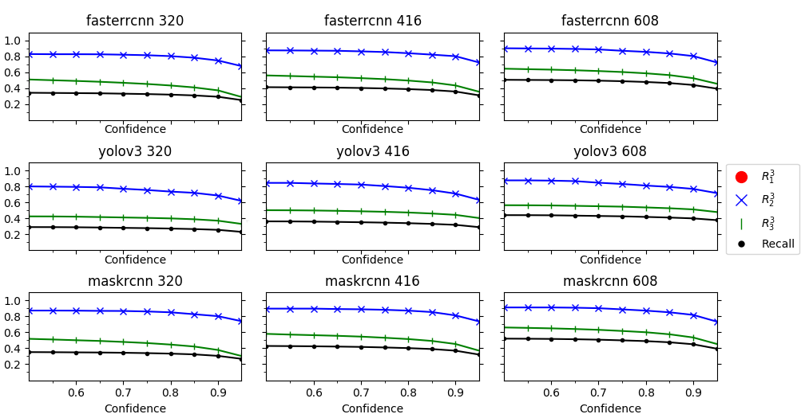

# Risk Ranked Recall
This project includes the evaluation tools for measuring [Risk Ranked Recall](https://arxiv.org/pdf/2106.04146.pdf), a collision safety metric for object detection systems in autonomous vehicles.


## Installation
Tested for Ubuntu 18.04, Python 3.6.9

Install Python3 and Pip or use your preferred python package manager.
pip3 upgrade is required to install waymo open dataset package in the next step.
```bash
sudo apt install python3 python3-pip -y
pip3 install --upgrade pip
```

Install dependencies from one of the two requirements files

* requirements.txt - shorter non versioned list, may be incomplete or incompatible at some point in future.
* reqs_auto.txt - created with pip3 freeze, contains unncessary packages.

```bash
pip3 install -r <requirement file>
```


## Usage
This example uses detection outputs provided in out_waymo directory.

```bash
./evaluate.py -det out_waymo -gt path_to_waymo_dataset
```

### Input format (-det)
Example of the format:

```json
{
    "segment-10206293520369375008_2796_800_2816_800_with_camera_labels.tfrecord": {
        "10206293520369375008_2796_800_2816_800_0_1": [
            [
                1.0,
                644.0,
                218.0,
                919.0,
                0.7838901877403259,
                0.9458864331245422,
                2
            ]
        ],
    }
}
```

Top level is dictionary with scene name as key *i.e.* video name.
Next level is an image, named as (frame context name + frame number + camera name). In the example above
```
frame context name = 10206293520369375008_2796_800_2816_800
frame number = 0
camera name = 1 = waymo_open_dataset.dataset_pb2.CameraName.FRONT
```
Final nested level is a list of detections. Each detection is in the form [x1, y1, x2, y2, class conf, objectness conf, COCO Class ID].

### Ground Truth Dataset (-gt)
Path to waymo open dataset data *i.e.* top level directory containing all tfrecord files.
Supports mutilevel lookup through the directory structure.

### Output Format
The included example provides the data for the example shown in the paper.




## Citation
Bibtex citation for this work:
```
@INPROCEEDINGS{9460196,
  author={Bansal, Ayoosh and Singh, Jayati and Verucchi, Micaela and Caccamo, Marco and Sha, Lui},
  booktitle={2021 10th Mediterranean Conference on Embedded Computing (MECO)}, 
  title={Risk Ranked Recall: Collision Safety Metric for Object Detection Systems in Autonomous Vehicles}, 
  year={2021},
  volume={},
  number={},
  pages={1-4},
  doi={10.1109/MECO52532.2021.9460196}}
```

## Contact
[Ayoosh Bansal](mailto:ayooshb2@illinois.edu)

